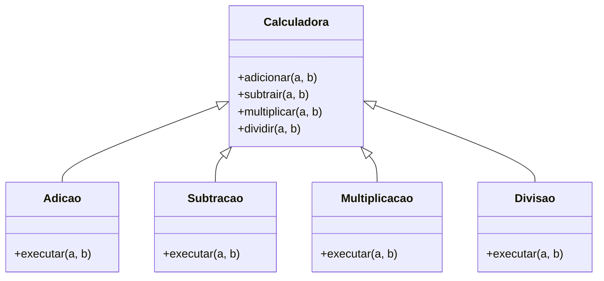

```mermaid
 classDiagram
    class Calculadora {
        +adicionar(a, b)
        +subtrair(a, b)
        +multiplicar(a, b)
        +dividir(a, b)
    }
    class Adicao {
        +executar(a, b)
    }
    class Subtracao {
        +executar(a, b)
    }
    class Multiplicacao {
        +executar(a, b)
    }
    class Divisao {
        +executar(a, b)
    }

    Calculadora <|-- Adicao
    Calculadora <|-- Subtracao
    Calculadora <|-- Multiplicacao
    Calculadora <|-- Divisao
```
