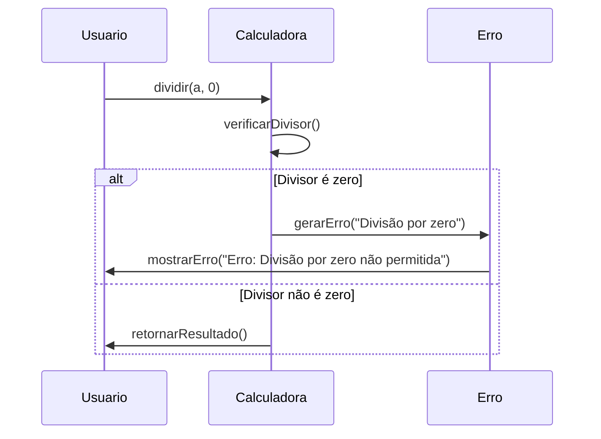

```mermaid
sequenceDiagram
    participant Usuario
    participant Calculadora
    participant Erro

    Usuario->>Calculadora: dividir(a, 0)
    Calculadora->>Calculadora: verificarDivisor()
    alt Divisor é zero
        Calculadora->>Erro: gerarErro("Divisão por zero")
        Erro->>Usuario: mostrarErro("Erro: Divisão por zero não permitida")
    else Divisor não é zero
        Calculadora->>Usuario: retornarResultado()
    end
```
