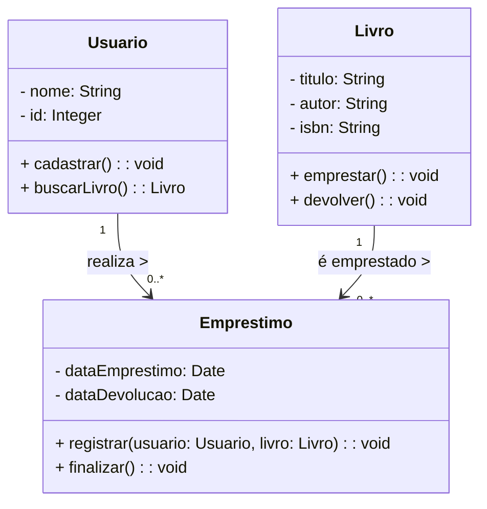

```mermaid
---
config:
  theme: mc
---
classDiagram
    class Livro {
        - titulo: String
        - autor: String
        - isbn: String
        + emprestar(): void
        + devolver(): void
    }

    class Usuario {
        - nome: String
        - id: Integer
        + cadastrar(): void
        + buscarLivro(): Livro
    }

    class Emprestimo {
        - dataEmprestimo: Date
        - dataDevolucao: Date
        + registrar(usuario: Usuario, livro: Livro): void
        + finalizar(): void
    }

    Usuario "1" --> "0..*" Emprestimo : realiza >
    Livro "1" --> "0..*" Emprestimo : é emprestado >
```
