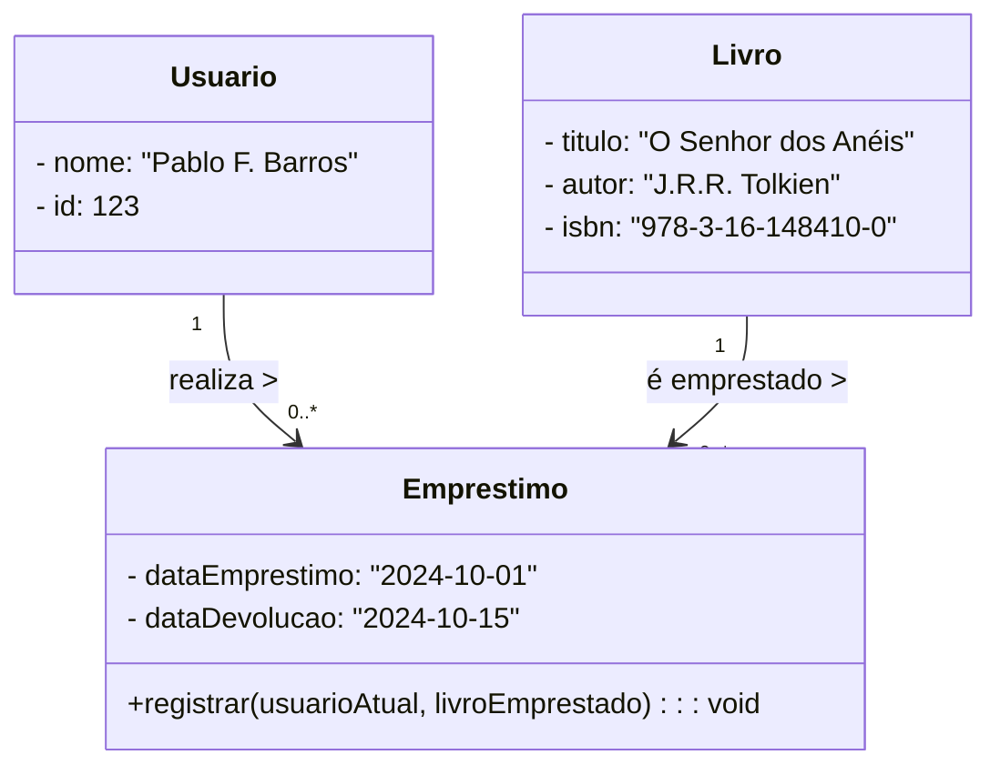

```mermaid
---
config:
  theme: mc
---
classDiagram
    class Livro {
        - titulo: "O Senhor dos Anéis"
        - autor: "J.R.R. Tolkien"
        - isbn: "978-3-16-148410-0"
    }

    class Usuario {
        - nome: "Pablo F. Barros"
        - id: 123
    }

    class Emprestimo {
        - dataEmprestimo: "2024-10-01"
        - dataDevolucao: "2024-10-15"
        +registrar(usuarioAtual, livroEmprestado) : : void 
    }

    Usuario "1" --> "0..*" Emprestimo : realiza >
    Livro "1" --> "0..*" Emprestimo : é emprestado >
```
