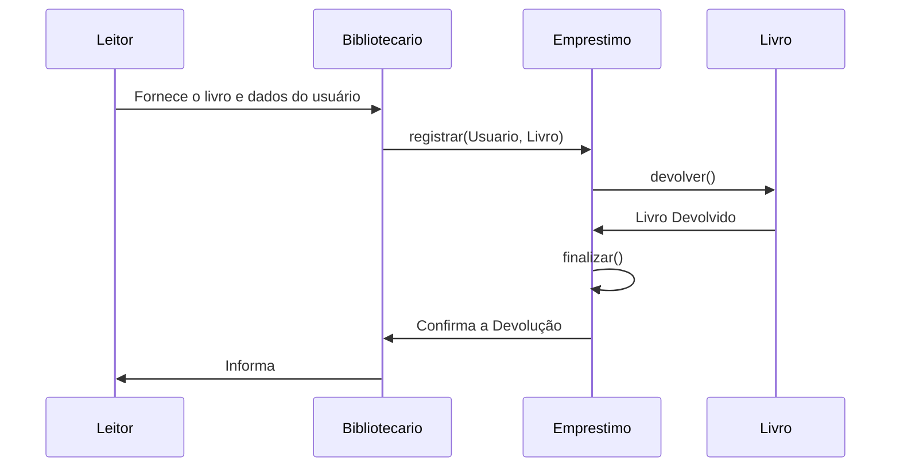

```mermaid
sequenceDiagram
    participant Leitor
    participant Bibliotecario
    participant Emprestimo
    participant Livro
    
    Leitor ->> Bibliotecario: Fornece o livro e dados do usuário
    Bibliotecario ->> Emprestimo: registrar(Usuario, Livro)
    Emprestimo ->> Livro: devolver()
    Livro ->> Emprestimo: Livro Devolvido
    Emprestimo ->> Emprestimo: finalizar()
    Emprestimo ->> Bibliotecario: Confirma a Devolução
    Bibliotecario ->> Leitor: Informa
    

```
